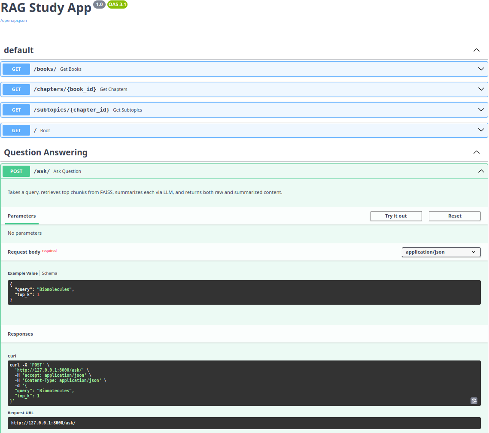
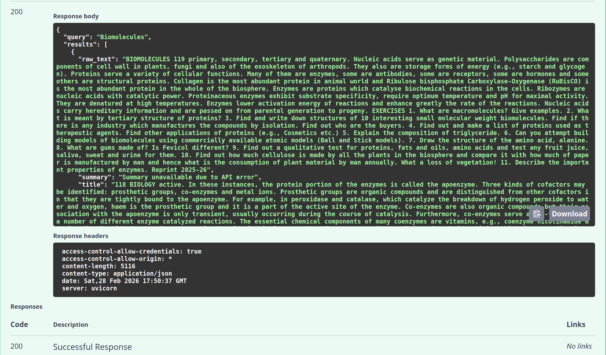

# NEET RAG Study App

NEET RAG Study App is a **Retrieval-Augmented Generation (RAG)** based study assistant designed to help users query and learn from medical study material efficiently. The system combines document ingestion, vector search, and LLM-based question answering to provide **context-aware, grounded responses** from uploaded study content.

The project is structured as a **full-stack application** with a Python-based backend and a frontend layer, following clean modular design principles.

---


## Project Overview

The application allows users to:

- Ingest study material (PDFs)
- Convert content into vector embeddings
- Store and search embeddings using FAISS
- Answer questions using a Retrieval-Augmented Generation pipeline
- Serve responses through a FastAPI backend

The architecture is optimized for **clarity, extensibility, and real-world RAG workflows**, rather than simple prompt-based demos.

---


## High-Level Architecture

1. **Document Ingestion**
   - PDFs are parsed and chunked
   - Chunks are embedded using a sentence-transformer model

2. **Vector Storage**
   - Embeddings are stored in a FAISS index
   - Index is persisted and reused across restarts

3. **Query Flow**
   - User query is embedded
   - Relevant chunks are retrieved from FAISS
   - Retrieved context is passed to an LLM for answer generation

4. **API Layer**
   - FastAPI exposes endpoints for querying and testing
   - Modular routers handle different resources

---

## Tech Stack

### Backend
- Python 3.10
- FastAPI
- FAISS (vector database)
- Sentence Transformers (`all-MiniLM-L6-v2`)
- NumPy (pinned to `< 2.0`)
- Uvicorn
- Docker (optional)

### Frontend
- Node.js (package scaffold present)

### Data
- PDF-based study material
- Vector index persisted to disk

---

## Project Structure

```
Neet_Proj2/
├── rag_study_app/
│   ├── backend/
│   │   ├── app/
│   │   │   ├── main.py              # FastAPI entry point
│   │   │   ├── config.py            # App configuration
│   │   │   ├── routers/             # API route definitions
│   │   │   ├── services/            # RAG, embedding, QA logic
│   │   │   ├── db/                  # FAISS vector DB logic
│   │   │   ├── scripts/             # Utility and setup scripts
│   │   │   └── utils/               # Helper utilities
│   │   ├── requirements.txt         # Backend dependencies
│   │   ├── Dockerfile               # Backend container setup
│   │   ├── start.sh                 # Startup script
│   │   ├── faiss.index              # Persisted FAISS index
│   │   └── faiss.index.chunks       # Index metadata
│   ├── data/
│   │   └── med-test-rag.pdf          # Sample study material
│   ├── frontend/
│   │   └── package.json             # Frontend scaffold
│   └── tests/
│       ├── test_embedding.py
│       ├── test_parser.py
│       └── test_qa.py
├── setup/
│   ├── folder.py
│   └── req.txt
└── README.md
```


---
---

## Architecture & Workflow

### RAG Stream Flow (Development)


### System Architecture




## Requirements

- Python 3.10
- pip
- Virtual environment (recommended)
- FAISS-compatible CPU
- Internet access (for model downloads on first run)

---

## Setup Instructions

### 1. Clone the repository

```bash
git clone https://github.com/Rithan377/Neet_Proj2.git
cd Neet_Proj2

Create and activate virtual environment
python3.10 -m venv venv
source venv/bin/activate

Install backend dependencies
cd rag_study_app/backend
pip install -r requirements.txt

Run the Backend Server

From the backend directory:

uvicorn app.main:app --reload

The server will start at:

http://127.0.0.1:8000

API Usage

Once running, visit:

http://127.0.0.1:8000/docs

This provides interactive Swagger documentation for testing endpoints.

Testing

Run tests from the rag_study_app directory:

pytest tests/  

Author
Rithan
GitHub: https://github.com/Rithan377


